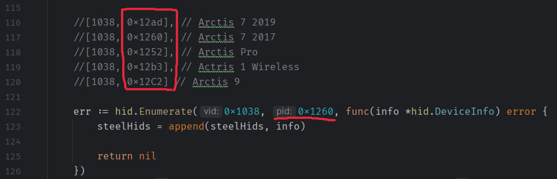

SteelSeries Arctis 1/7/9/Pro battery status tray icon for Windows/MacOS

# windows build
1) install gcc

install choco https://chocolatey.org/install
```
choco install mingw -y
check: gcc -v
```

2) CGO_ENABLED
```
set CGO_ENABLED=1
go run -race .
```

3) reboot
4) If u need, change pid data at `main.go`
   
5) build

```go build -ldflags -H=windowsgui```


MacOS
